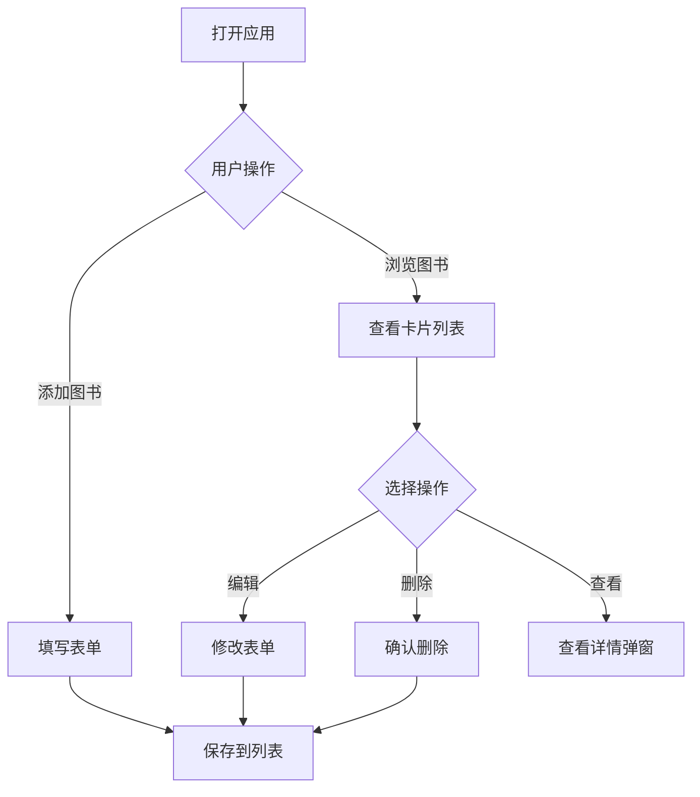

# 图书管理系统 - 产品需求文档 (PRD)

## 1. 产品概述

一个现代化的图书管理系统，为个人或小型图书馆提供便捷的书籍管理体验。用户可以轻松添加、浏览、编辑和删除图书记录，实现书籍的有序管理。系统采用直观的卡片式布局，让用户能够快速查看书籍信息。

**核心价值**：
- 简洁高效的操作流程
- 美观舒适的视觉体验
- 即时响应的交互反馈

## 2. 核心功能

### 2.1 角色说明
本系统为单用户应用，无需登录认证，直接使用。

### 2.2 功能模块

**核心功能**：
1. **图书列表页**：展示所有图书卡片，支持搜索和筛选
2. **添加图书**：通过表单添加新书籍
3. **编辑图书**：修改现有图书信息
4. **删除图书**：移除不需要的图书记录
5. **查看详情**：点击卡片查看书籍详细信息

**数据存储**：
- 使用浏览器 LocalStorage 进行数据持久化
- 无需后端服务器，纯前端实现

## 3. 核心流程

### 3.1 主要用户流程



### 3.2 图书数据字段

| 字段 | 类型 | 说明 |
|------|------|------|
| id | string | 唯一标识符 |
| title | string | 书名（必填） |
| author | string | 作者（必填） |
| isbn | string | ISBN编号 |
| publisher | string | 出版社 |
| publishDate | string | 出版年份 |
| category | string | 分类 |
| description | string | 简介 |
| cover | string | 封面图片URL |
| rating | number | 评分 1-5 |
| status | string | 阅读状态（未读/在读/已读） |
| createdAt | string | 添加时间 |

## 4. 用户界面设计

### 4.1 设计风格

**视觉风格**：文学编辑风格 + 现代卡片设计

**色彩方案**：
- 主色调：深靛蓝 `#2c3e50` - 沉稳专业
- 强调色：琥珀金 `#f39c12` - 温暖活力
- 背景色：米白 `#faf9f7` - 舒适阅读
- 文字色：深灰 `#2d3436` - 高可读性
- 辅助色：薄荷绿 `#00b894` - 成功状态
- 警示色：珊瑚红 `#e74c3c` - 删除/警告

**字体设计**：
- 标题字体：`"Playfair Display"` - 优雅的衬线体
- 正文字体：`"Source Sans Pro"` - 清晰的无衬线体

**布局风格**：
- 响应式卡片网格布局
- 顶部导航 + 搜索栏
- 卡片悬停微动效
- 模态框进行添加/编辑

**图标风格**：
- 使用 Lucide Icons
- 线条风格，2px 描边
- 统一尺寸 24px

### 4.2 页面结构

**主页面**：
- 顶部导航栏（标题 + 搜索框 + 添加按钮）
- 筛选标签栏（分类筛选）
- 图书卡片网格（响应式 1-4 列）
- 状态指示器（阅读状态标记）

**卡片设计**：
- 封面图片（占卡片 40%）
- 书名 + 作者（标题区）
- 分类标签
- 评分星星
- 操作按钮（编辑/删除/详情）

**模态框**：
- 添加/编辑表单
- 详情查看弹窗
- 删除确认对话框

### 4.3 响应式设计

- **桌面端 (≥1200px)**：4列卡片网格
- **笔记本端 (≥992px)**：3列卡片网格
- **平板端 (≥768px)**：2列卡片网格
- **移动端 (<768px)**：单列卡片，底部操作栏

### 4.4 交互效果

**卡片悬停**：
- 轻微上浮 (translateY: -4px)
- 阴影加深
- 边框高亮

**按钮点击**：
- 轻微缩放 (scale: 0.95)
- 颜色加深

**页面加载**：
- 卡片依次淡入 (stagger 50ms)
- 搜索框聚焦时边框发光

**表单验证**：
- 实时验证提示
- 错误状态红色边框
- 成功状态绿色边框

## 5. 技术实现

### 5.1 技术栈

- **框架**：React 18 + Vite
- **样式**：Tailwind CSS
- **图标**：Lucide React
- **数据**：LocalStorage
- **字体**：Google Fonts

### 5.2 组件结构

```
src/
├── components/
│   ├── BookCard.jsx        # 图书卡片组件
│   ├── BookForm.jsx        # 添加/编辑表单
│   ├── BookDetail.jsx      # 详情弹窗
│   ├── SearchBar.jsx       # 搜索栏
│   ├── CategoryFilter.jsx  # 分类筛选
│   └── ConfirmDialog.jsx   # 确认对话框
├── hooks/
│   └── useBooks.js         # 图书数据管理
├── App.jsx                 # 主应用
└── main.jsx                # 入口文件
```

## 6. 验收标准

### 6.1 功能验收

- [ ] 能够添加新图书，表单验证必填项
- [ ] 图书列表正确显示所有图书
- [ ] 能够编辑图书信息并保存
- [ ] 能够删除图书（带确认提示）
- [ ] 搜索功能实时过滤图书
- [ ] 分类筛选正常工作
- [ ] 数据持久化到 LocalStorage
- [ ] 刷新页面后数据保留

### 6.2 视觉验收

- [ ] 卡片布局美观大方
- [ ] 配色方案统一协调
- [ ] 字体清晰易读
- [ ] 动画效果流畅自然
- [ ] 响应式布局正常
- [ ] 移动端体验良好
