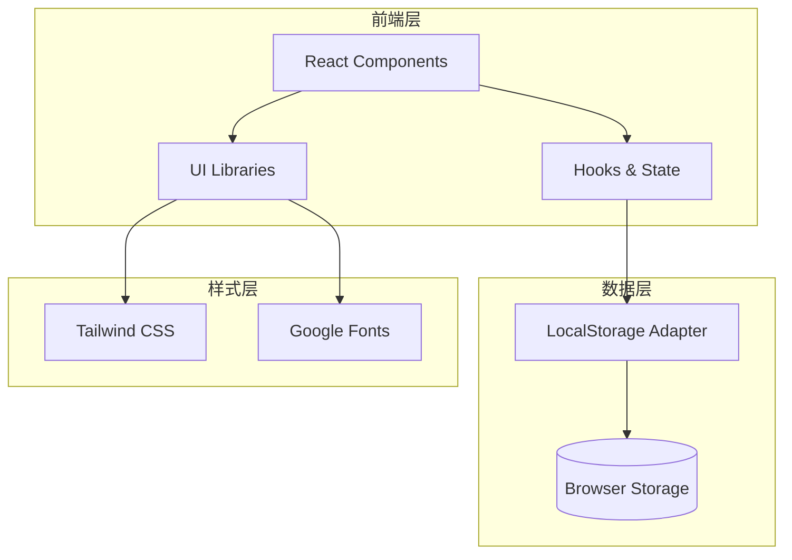
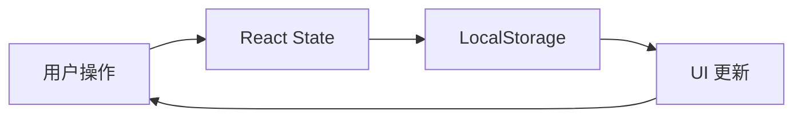
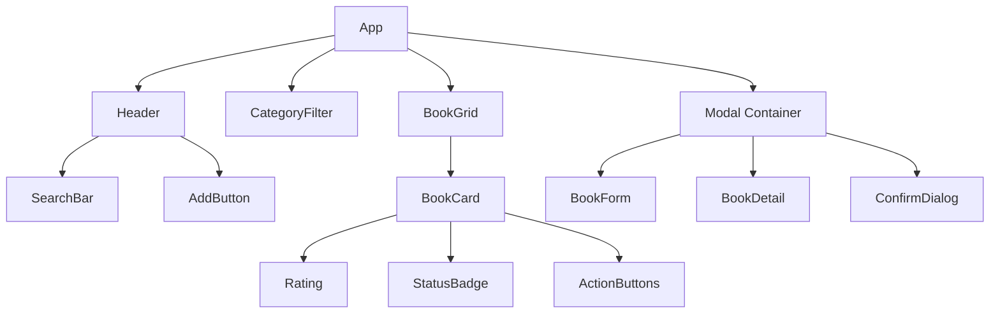
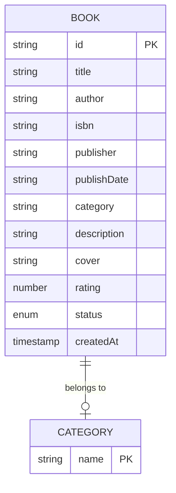
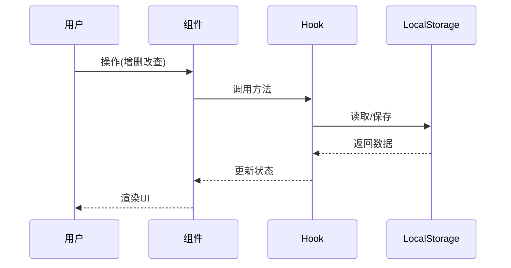

# 图书管理系统 - 技术架构文档

## 1. 架构设计



## 2. 技术栈说明

### 2.1 核心技术
- **前端框架**：React 18 - 组件化开发
- **构建工具**：Vite - 快速开发体验
- **样式框架**：Tailwind CSS - 实用优先的CSS框架
- **图标库**：Lucide React - 轻量级图标库
- **字体**：Google Fonts CDN

### 2.2 数据管理
- **存储方案**：LocalStorage
- **数据结构**：JSON 格式
- **数据键名**：`library_books`

## 3. 路由定义

由于是单页面应用，采用组件切换模式：

| 视图 | 组件 | 功能 |
|------|------|------|
| 主列表 | BookList | 显示所有图书卡片 |
| 添加表单 | BookForm | 新增图书 |
| 编辑表单 | BookForm | 编辑图书 |
| 详情弹窗 | BookDetail | 查看图书详情 |
| 确认对话框 | ConfirmDialog | 删除确认 |

## 4. API 定义（LocalStorage 操作）

### 4.1 数据操作接口

```typescript
// 图书对象类型
interface Book {
  id: string;
  title: string;
  author: string;
  isbn?: string;
  publisher?: string;
  publishDate?: string;
  category?: string;
  description?: string;
  cover?: string;
  rating?: number;
  status?: 'unread' | 'reading' | 'completed';
  createdAt: string;
}

// LocalStorage 操作
interface BookStorage {
  getAll(): Book[];
  getById(id: string): Book | null;
  add(book: Omit<Book, 'id' | 'createdAt'>): Book;
  update(id: string, book: Partial<Book>): Book | null;
  delete(id: string): boolean;
  search(query: string): Book[];
  filterByCategory(category: string): Book[];
}
```

### 4.2 数据流转



## 5. 组件架构

### 5.1 组件层次结构



### 5.2 组件职责

| 组件 | 职责 | Props |
|------|------|-------|
| App | 状态管理、路由控制 | - |
| Header | 顶部导航、搜索入口 | onSearch, onAdd |
| SearchBar | 搜索输入框 | value, onChange |
| CategoryFilter | 分类筛选标签 | categories, selected, onChange |
| BookGrid | 图书卡片网格容器 | books |
| BookCard | 单个图书卡片展示 | book, onEdit, onDelete, onView |
| Rating | 星级评分显示 | rating |
| StatusBadge | 阅读状态标签 | status |
| ActionButtons | 编辑/删除/查看按钮 | onEdit, onDelete, onView |
| BookForm | 添加/编辑表单 | book?, onSubmit, onCancel |
| BookDetail | 图书详情弹窗 | book, onClose |
| ConfirmDialog | 删除确认对话框 | title, message, onConfirm, onCancel |
| Modal | 模态框容器 | isOpen, onClose, children |

## 6. 数据模型

### 6.1 数据结构



### 6.2 数据示例

```json
{
  "books": [
    {
      "id": "bk_1709123456789",
      "title": "JavaScript高级程序设计",
      "author": "Nicholas C. Zakas",
      "isbn": "978-7-115-42833-8",
      "publisher": "人民邮电出版社",
      "publishDate": "2020-03",
      "category": "技术",
      "description": "JavaScript经典著作，涵盖ES6+新特性",
      "cover": "https://example.com/cover.jpg",
      "rating": 5,
      "status": "reading",
      "createdAt": "2024-01-15T10:30:00Z"
    }
  ]
}
```

## 7. 状态管理

### 7.1 React State 结构

```javascript
const [state, setState] = useState({
  books: [],           // 图书列表
  filteredBooks: [],   // 筛选后的列表
  searchQuery: '',     // 搜索关键词
  selectedCategory: '', // 选中的分类
  modalType: null,     // 模态框类型：'add' | 'edit' | 'detail' | 'confirm'
  currentBook: null,   // 当前操作的图书
  isLoading: false     // 加载状态
});
```

### 7.2 数据流转



## 8. 性能优化

### 8.1 渲染优化
- 使用 React.memo 缓存组件
- 使用 useMemo 缓存筛选结果
- 使用 useCallback 缓存回调函数

### 8.2 加载优化
- 图片懒加载
- 卡片虚拟列表（数据量大时）
- 代码分割

## 9. 错误处理

### 9.1 错误场景
- LocalStorage 满
- 数据格式错误
- 图片加载失败

### 9.2 容错策略
- try-catch 包装存储操作
- 数据验证与清理
- 降级显示（图片占位符）

## 10. 项目初始化命令

```bash
# 创建 React + Vite 项目
npm create vite@latest library-system -- --template react

# 进入项目目录
cd library-system

# 安装依赖
npm install

# 安装 Tailwind CSS
npm install -D tailwindcss postcss autoprefixer
npx tailwindcss init -p

# 安装 Lucide Icons
npm install lucide-react

# 启动开发服务器
npm run dev
```
