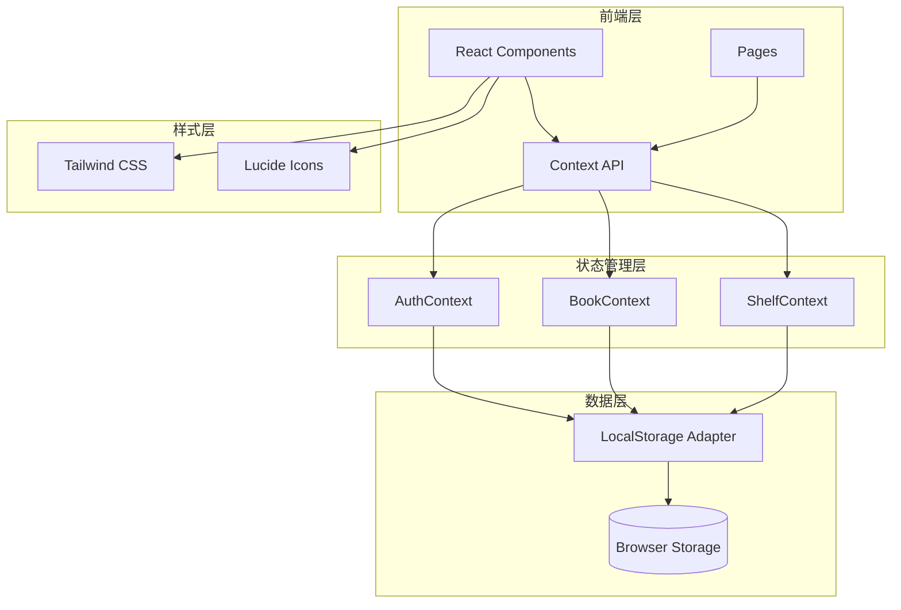
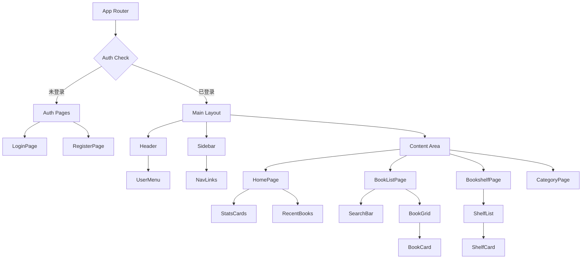

# 图书管理系统 - 技术架构文档 V2

## 1. 架构设计

### 1.1 系统架构图



## 2. 技术栈说明

### 2.1 核心技术

- **前端框架**：React 18 - 组件化开发
- **构建工具**：Vite - 快速开发体验
- **样式框架**：Tailwind CSS - 实用优先的CSS框架
- **图标库**：Lucide React - 轻量级图标库
- **类型系统**：TypeScript - 类型安全
- **路由管理**：React Router DOM v6

### 2.2 数据管理

- **存储方案**：LocalStorage
- **数据结构**：JSON 格式
- **数据键名**：
  - `library_users` - 用户列表
  - `library_current_user` - 当前登录用户
  - `library_books_{userId}` - 用户图书
  - `library_shelves_{userId}` - 用户书架

## 3. 页面路由

| 路由 | 组件 | 功能 | 权限 |
|------|------|------|------|
| `/login` | LoginPage | 用户登录 | 公开 |
| `/register` | RegisterPage | 用户注册 | 公开 |
| `/` | HomePage | 个人主页 | 需登录 |
| `/books` | BookListPage | 图书列表 | 需登录 |
| `/shelf` | BookshelfPage | 书架管理 | 需登录 |
| `/categories` | CategoryPage | 分类管理 | 需登录 |

## 4. 数据模型

### 4.1 用户模型

```typescript
interface User {
  id: string;
  username: string;
  email?: string;
  phone?: string;
  password: string;
  avatar?: string;
  createdAt: string;
}
```

### 4.2 书架模型

```typescript
interface Shelf {
  id: string;
  userId: string;
  name: string;
  color: string;
  sortOrder: number;
  isDefault: boolean;
  createdAt: string;
}
```

### 4.3 图书模型

```typescript
interface Book {
  id: string;
  userId: string;
  title: string;
  author: string;
  isbn?: string;
  publisher?: string;
  publishDate?: string;
  category?: string;
  description?: string;
  cover?: string;
  rating?: number;
  status?: 'unread' | 'reading' | 'completed';
  shelfId?: string;
  createdAt: string;
}
```

### 4.4 分类模型

```typescript
interface Category {
  id: string;
  userId: string;
  name: string;
  isSystem: boolean;
  sortOrder: number;
  createdAt: string;
}
```

## 5. 组件架构

### 5.1 组件层次结构



### 5.2 Context API 结构

```typescript
// AuthContext - 认证状态管理
interface AuthContextType {
  user: User | null;
  isAuthenticated: boolean;
  login: (email: string, password: string) => Promise<boolean>;
  register: (userData: RegisterData) => Promise<boolean>;
  logout: () => void;
}

// BookContext - 图书状态管理
interface BookContextType {
  books: Book[];
  addBook: (book: BookFormData) => void;
  updateBook: (id: string, book: Partial<Book>) => void;
  deleteBook: (id: string) => void;
  getBooksByShelf: (shelfId: string) => Book[];
  getBooksByCategory: (category: string) => Book[];
  searchBooks: (query: string) => Book[];
}

// ShelfContext - 书架状态管理
interface ShelfContextType {
  shelves: Shelf[];
  defaultShelves: Shelf[];
  addShelf: (shelf: ShelfFormData) => void;
  updateShelf: (id: string, shelf: Partial<Shelf>) => void;
  deleteShelf: (id: string) => void;
}
```

## 6. LocalStorage 操作接口

### 6.1 用户操作

```typescript
const UserStorage = {
  getAll: (): User[] => {...},
  getById: (id: string): User | null => {...},
  getByEmail: (email: string): User | null => {...},
  getByPhone: (phone: string): User | null => {...},
  add: (user: User): User => {...},
  update: (id: string, user: Partial<User>): User | null => {...},
  delete: (id: string): boolean => {...}
};
```

### 6.2 图书操作

```typescript
const BookStorage = {
  getAll: (userId: string): Book[] => {...},
  getById: (userId: string, bookId: string): Book | null => {...},
  add: (userId: string, book: Book): Book => {...},
  update: (userId: string, bookId: string, book: Partial<Book>): Book | null => {...},
  delete: (userId: string, bookId: string): boolean => {...},
  search: (userId: string, query: string): Book[] => {...},
  filter: (userId: string, filters: BookFilters): Book[] => {...}
};
```

### 6.3 书架操作

```typescript
const ShelfStorage = {
  getAll: (userId: string): Shelf[] => {...},
  getById: (userId: string, shelfId: string): Shelf | null => {...},
  add: (userId: string, shelf: Shelf): Shelf => {...},
  update: (userId: string, shelfId: string, shelf: Partial<Shelf>): Shelf | null => {...},
  delete: (userId: string, shelfId: string): boolean => {...},
  initDefaults: (userId: string): Shelf[] => {...}
};
```

## 7. 页面详细设计

### 7.1 登录/注册页

**布局**：
- 居中卡片式布局
- Logo和标题在顶部
- 表单在中间
- 切换登录/注册链接在底部

**验证规则**：
- 邮箱：标准邮箱格式
- 手机号：11位数字，以1开头
- 密码：至少6位
- 确认密码：与密码一致

### 7.2 个人主页

**顶部区域**：
- 用户头像（圆形）
- 用户名和邮箱
- 退出登录按钮

**统计卡片**：
- 4个卡片横向排列
- 图书总数、在读、已读、想读
- 每个卡片显示数字和图标

**快捷操作**：
- 添加图书按钮
- 管理书架按钮
- 管理分类按钮

**最近阅读**：
- 显示最近添加或更新的3本书
- 卡片式展示

### 7.3 图书列表页

**顶部**：
- 搜索框（全宽）
- 添加图书按钮

**筛选区**：
- 书架筛选下拉框
- 分类筛选标签
- 阅读状态筛选
- 评分筛选

**图书网格**：
- 响应式网格布局
- 1-4列自适应
- 卡片包含：封面、书名、作者、评分、操作按钮

### 7.4 书架管理页

**书架列表**：
- 网格布局
- 每个书架卡片显示：
  - 书架名称
  - 图书数量
  - 书架颜色标记
  - 编辑/删除按钮

**添加书架**：
- 弹出表单
- 输入书架名称
- 选择颜色

### 7.5 分类管理页

**分类列表**：
- 表格形式展示
- 显示分类名称、图书数量
- 系统分类不可删除
- 自定义分类可编辑/删除

**添加分类**：
- 输入分类名称
- 确认添加

## 8. 默认数据

### 8.1 默认书架

```json
[
  { "name": "全部图书", "color": "#3b82f6", "isDefault": true },
  { "name": "正在阅读", "color": "#f97316", "isDefault": true },
  { "name": "已读完", "color": "#22c55e", "isDefault": true },
  { "name": "想读", "color": "#8b5cf6", "isDefault": true }
]
```

### 8.2 默认分类

```json
[
  { "name": "技术", "isSystem": true },
  { "name": "文学", "isSystem": true },
  { "name": "历史", "isSystem": true },
  { "name": "经济", "isSystem": true },
  { "name": "设计", "isSystem": true },
  { "name": "哲学", "isSystem": true },
  { "name": "科学", "isSystem": true },
  { "name": "其他", "isSystem": true }
]
```

## 9. 路由守卫

```typescript
// PrivateRoute 组件
const PrivateRoute = ({ children }) => {
  const { isAuthenticated } = useAuth();
  
  if (!isAuthenticated) {
    return <Navigate to="/login" replace />;
  }
  
  return children;
};

// 使用方式
<Routes>
  <Route path="/login" element={<LoginPage />} />
  <Route path="/register" element={<RegisterPage />} />
  <Route 
    path="/" 
    element={
      <PrivateRoute>
        <HomePage />
      </PrivateRoute>
    } 
  />
</Routes>
```

## 10. 性能优化

### 10.1 组件优化

- 使用 `React.memo` 缓存纯展示组件
- 使用 `useMemo` 缓存计算结果
- 使用 `useCallback` 缓存回调函数

### 10.2 数据优化

- 按需加载数据
- 分页加载（图书数量多时）
- 本地缓存优化

### 10.3 加载优化

- 骨架屏加载状态
- 图片懒加载
- 代码分割

## 11. 错误处理

### 11.1 表单验证

- 实时验证
- 错误提示
- 提交前验证

### 11.2 操作反馈

- 成功提示（Toast）
- 错误提示
- 确认对话框（删除等危险操作）

### 11.3 异常处理

- LocalStorage 满
- 数据格式错误
- 网络错误（模拟）

## 12. 项目初始化命令

```bash
# 安装依赖
npm install react-router-dom

# 启动开发服务器
npm run dev
```
